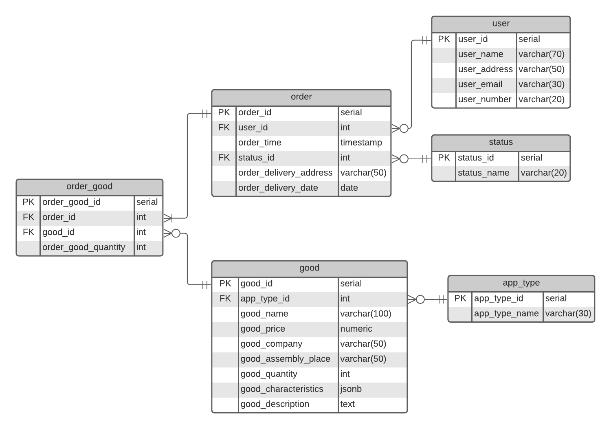
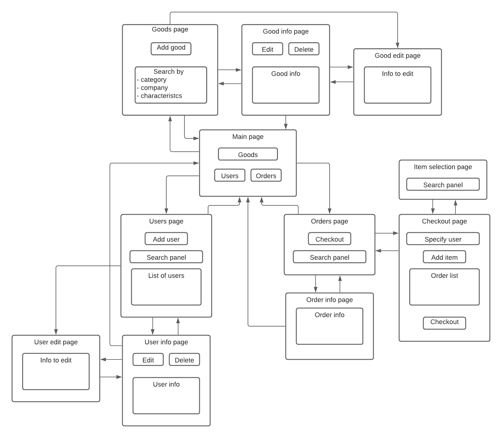

# Практикум по Web-технологиям

#### **Интернет-магазин бытовой техники**  
-------------------------------------

## Схема базы данных приложения

* ***appliance_type*** - перечислимый тип, возможные значения: *{ 'coffee_maker', 'cooktop', 'fridge', 'microwave', 'tv', 'vacuum_cleaner', 'washer' }* (при необходимости можно добавить новые)  
* ***status_type*** - перечислимый тип; возможные значения: *{ 'complete', 'delivered', 'processing' }*

## Описание страниц сайта

### Схема навигации между страницами:

### Содержимое страниц:
* **Main page** (главная страница сайта) содержит ссылки на **Goods page**, **Users page** и **Orders page**.

* **Goods page** (основная страница товаров) содержит кнопку добавления нового товара ***Add good*** (ведет на **Good edit page**), а также позволяет производить поиск товаров по типам, производителям и характеристикам (полная информация о товаре появляется после перехода на **Good info page**).
    * **Good info page** содержит информацию о конкретном товаре, позволяет редактировать ее и удалять товар. Соответственно, нажатие кнопки ***Edit*** ведет на **Good edit page**, а кнопки ***Edit*** -- удаляет товар, после чего происходит переход обратно на **Goods page**. С этой страницы можно вернуться обратно на **Goods page**.
    * **Good edit page** позволяет редактировать данные о товаре. После сохранения изменений происходит переход на **Good info page** соответствующего товара.

* **Users page** (основная страница клиентов магазина) содержит кнопку для добавления нового клиента ***Add user*** (ведет на **User edit page**) и полный список клиентов ***List of users***, также позволяет производить поиск конкретного клиента для получения более детальной информации о нем (появляется после перехода на **User info page**).
    * **User info page** содержит информацию о конкретном клиенте, позволяет редактировать ее и удалять клиента из базы (соответственно, кнопки ***Edit*** -- ведет на **User edit page** -- и ***Delete*** -- после удаления происходит возврат на **User info page**). Также отсюда можно перейти обратно на **Users page**.
    * **User edit page** позволяет редактировать данные о товаре. После сохранения изменений происходит переход на **User info page** соответствующего товара.

* **Orders page** (основная страница заказов) содержит кнопку ***Checkout** для оформления нового заказа (ведет на **Checkout page**) и панель поиска (выдает список заказов, оформленных в заданный период; при переходе на **Order info page** появляется полная информация о конкретном заказе).
    * **Order info page** содержит информацию о заказе, включающую его полную стоимость, текущий статус (в обработке, собран, доставлен) и другие данные. С этой страницы можно вернуться на **Order info page**.
    * **Checkout page** - страница сборки и оформления заказа. Содержит поисковую панель для выбора клиента-заказчика, текущий состав заказа и кнопку ***Add item*** для добавления нового товара в заказ (ведет на **Item selection page**). Оформление заказа выполняется с помощью нажатия кнопки ***Checkout***, после которого происходит переход обратно на **Orders page**.
    * **Item selection page** содержит панель поиска товаров. После выбора конкретного товара происходит возврат на **Checkout page**.  

Также на **Main page** можно перейти со всех страниц, кроме страниц редактирования и удаления, а также страниц, связанных с оформлением заказа (то есть переход осуществляется cо страниц **Goods page**, **Good info page**, **Users page**, **User info page**, **Orders page** и **Order info page**).  

## Сценарии использования
Стрелкой (→) обозначается переход на другую страницу, дефисом (-) страница соединяется с кнопкой/ссылкой, которая на ней находится.
* **Добавление нового клиента**  
    *Main page - Users → Users page - Add user*
* **Удаление клиента**  
    *Main page - Users → Users page - Search panel → User info page - Delete*
* **Получение данных о клиенте (в т. ч. список сделанных им заказов**  
    *Main page - Users → Users page - Search panel → User info page*
* **Редактирование данных о клиенте**  
    *Main page - Users → Users page - Search panel → User info page - Edit*
* **Добавление нового товара**  
    *Main page - Goods → Goods page - Add good*
* **Удаление товара**  
    *Main page - Goods → Goods page - Search panel → Good info page - Delete*
* **Получение данных о товаре (в частности, информации о наличии и цене товара)**  
    *Main page - Goods → Goods page - Search panel → Good info page*
* **Редактирование данных о товаре**  
    *Main page - Goods → Goods page - Search panel → Good info page - Edit*
* **Оформление заказа**  
    *Main page - Orders → Orders page - Checkout → Checkout page*
    1. *- Specify user*
    2. *- Add item → Item selection page - Search panel → Checkout page*
    3. *повторять пункт 2 до тех пор, пока не добавлены все необходимые товары*
    4. *- Checkout*
* **Проверка статуса заказа**  
    *Main page - Orders → Orders page - Order info page*
* **Получение списка товаров по типам (производителям, характеристикам и т. д.)**  
    *Main page - Goods → Goods page - Search panel*
