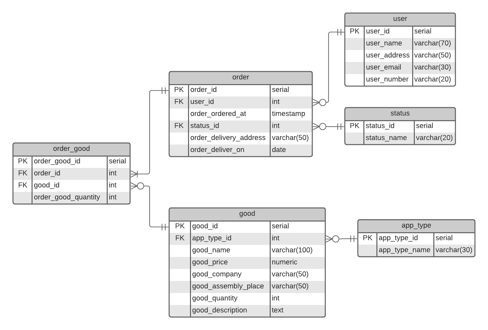

# Практикум по Web-технологиям

#### **Интернет-магазин бытовой техники**  
-------------------------------------

## Схема базы данных приложения



## Описание страниц сайта

### Схема навигации между страницами:


### Содержимое страниц:
* **Main page** (главная страница сайта) содержит ссылки на **Goods page**, **Users page** и **Orders page**.

* **Goods page** (основная страница товаров) содержит кнопку добавления нового товара ***Add good*** (ведет на **Good edit page**), а также позволяет производить поиск товаров по типам, производителям и характеристикам (полная информация о товаре появляется после перехода на **Good info page**).
    * **Good info page** содержит информацию о конкретном товаре, позволяет редактировать ее и удалять товар. Соответственно, нажатие кнопки ***Edit*** ведет на **Good edit page**, а кнопки ***Edit*** -- удаляет товар, после чего происходит переход обратно на **Goods page**. С этой страницы можно вернуться обратно на **Goods page**.
    * **Good edit page** позволяет редактировать данные о товаре. После сохранения изменений происходит переход на **Good info page** соответствующего товара.

* **Users page** (основная страница клиентов магазина) содержит кнопку для добавления нового клиента ***Add user*** (ведет на **User edit page**) и полный список клиентов ***List of users***, также позволяет производить поиск конкретного клиента для получения более детальной информации о нем (появляется после перехода на **User info page**).
    * **User info page** содержит информацию о конкретном клиенте, позволяет редактировать ее и удалять клиента из базы (соответственно, кнопки ***Edit*** -- ведет на **User edit page** -- и ***Delete*** -- после удаления происходит возврат на **User info page**). Также отсюда можно перейти обратно на **Users page**.
    * **User edit page** позволяет редактировать данные о товаре. После сохранения изменений происходит переход на **User info page** соответствующего товара.

* **Orders page** (основная страница заказов) содержит кнопку ***Checkout** для оформления нового заказа (ведет на **Checkout page**) и панель поиска (выдает список заказов, оформленных в заданный период; при переходе на **Order info page** появляется полная информация о конкретном заказе).
    * **Order info page** содержит информацию о заказе, включающую его полную стоимость, текущий статус (в обработке, собран, доставлен) и другие данные. С этой страницы можно вернуться на **Order info page**.
    * **Checkout page** - страница сборки и оформления заказа. Содержит поисковую панель для выбора клиента-заказчика, текущий состав заказа и кнопку ***Add item*** для добавления нового товара в заказ (ведет на **Item selection page**). Оформление заказа выполняется с помощью нажатия кнопки ***Checkout***, после которого происходит переход обратно на **Orders page**.
    * **Item selection page** содержит панель поиска товаров. После выбора конкретного товара происходит возврат на **Checkout page**.  

Также на **Main page** можно перейти со всех страниц, кроме страниц редактирования и удаления, а также страниц, связанных с оформлением заказа (то есть переход осуществляется cо страниц **Goods page**, **Good info page**, **Users page**, **User info page**, **Orders page** и **Order info page**).  

## Use cases
Стрелкой (→) обозначается переход на другую страницу, дефисом (-) страница соединяется с кнопкой/ссылкой, которая на ней находится.
* **Добавление нового клиента**  
    *Main page - Users → Users page - Add user*
* **Удаление клиента**  
    *Main page - Users → Users page - Search panel → User info page - Delete*
* **Получение данных о клиенте (в т. ч. список сделанных им заказов**  
    *Main page - Users → Users page - Search panel → User info page*
* **Редактирование данных о клиенте**  
    *Main page - Users → Users page - Search panel → User info page - Edit*
* **Добавление нового товара**  
    *Main page - Goods → Goods page - Add good*
* **Удаление товара**  
    *Main page - Goods → Goods page - Search panel → Good info page - Delete*
* **Получение данных о товаре (в частности, информации о наличии и цене товара)**  
    *Main page - Goods → Goods page - Search panel → Good info page*
* **Редактирование данных о товаре**  
    *Main page - Goods → Goods page - Search panel → Good info page - Edit*
* **Оформление заказа**  
    *Main page - Orders → Orders page - Checkout → Checkout page*
    1. *- Add item → Item selection page - Search panel → Checkout page*
    2. *повторять пункт 2 до тех пор, пока не добавлены все необходимые товары*
    3. *- Specify user*
    4. *- Checkout*
* **Проверка статуса заказа**  
    *Main page - Orders → Orders page - Order info page*
* **Получение списка товаров по типам (производителям, характеристикам и т. д.)**  
    *Main page - Goods → Goods page - Search panel*

## Build & Test  

### Дополнительные требования  

Для успешной сборки приложения необходимо выполнение следующих условий.  
  
    1. Установленная СУБД PostgreSQL версии не ниже 11.  
    2. Наличие суперпользователя admin с паролем admin. Его можно создать такой командой:   

```
postgres=# create user admin superuser password 'admin';
```
### Build Lifecycle  

Приложение собирается с помощью фреймворка [Apache Maven](https://maven.apache.org/ "Apache Maven"), поэтому доступны все этапы [основного цикла сбоки maven](https://maven.apache.org/guides/introduction/introduction-to-the-lifecycle.html#a-build-lifecycle-is-made-up-of-phases "Maven Build Lifecycle"). В частности,  
```
[user@domain:~/appliances] mvn compile  # компиляция исходного кода  
[user@domain:~/appliances] mvn test     # запуск тестов 
```  

### Генерация покрытия  

Для создания code coverage используется фреймворк [Jacoco](https://www.jacoco.org/jacoco/ "Jacoco"). Покрытие автоматически генерируется при запуске тестов.  
Вся информация о покрытии помещается в папку ``appliances/target/site/jacoco``. Наиболее наглядным является отчет в html-формате (``appliances/target/site/jacoco/index.html`` и дальше по ссылкам).  

## Системное тестирование  

Системные тесты написаны с помощью фреймворка [Selenium](https://www.selenium.dev/, "Selenium"), а также с использованием паттерна [Page Object](https://www.selenium.dev/documentation/en/guidelines_and_recommendations/page_object_models/, "Page Object Pattern").  
Запустить тесты можно командой  
```
[user@domain:~/appliances] mvn test
```  

## Frontend  

Страницы приложения написаны на HTML с использованием шаблонизатора [Thymeleaf](https://www.thymeleaf.org/, "Thymeleaf Template Engine").

## Run & Deploy  

### Spring Boot & Tomcat  

Приложение можно запустить локально с помощью цели ``run`` плагина maven [Spring Boot](https://spring.io/projects/spring-boot "Spring Boot"):  

```
[user@domain:~/appliances] mvn spring-boot:run
```  
При этом приложение развернется в [контейнере сервлетов](https://en.wikipedia.org/wiki/Web_container, "Web Container") [Apache Tomcat](https://tomcat.apache.org/, "Apache Tomcat"). В этом случае сборку нужно выполнять из ветки ``master``, при этом очистка и  инициализация тестовой базы данных выполняются автоматически.  

### Docker  

* **Создание образа**  

    Для создания [docker](https://en.wikipedia.org/wiki/Web_container, "docker")-образа необходимо проделать следующее:  
    1. Собрать приложение из ветки ``deploy`` с помощью команды  
    ```
    [user@domain:~/appliances] mvn package
    ```  
    2. Собственно, создать образ (для этого написан файл сборки ``Dockerfile``) и залить его на [Dockerhub](https://hub.docker.com/, "Dockerhub"):  
    ```  
    [user@domain:~/appliances] sudo docker build . --tag appliances-online-store
    [user@domain:~/appliances] sudo docker image tag appliances-online-store augenzu/appliances-online-store:latest
    [user@domain:~/appliances] sudo docker login
    [user@domain:~/appliances] sudo docker image push augenzu/appliances-online-store:latest  
    ```  
    3. Теперь образ можно устанавливать куда угодно с помощью команды  
    ```  
    sudo docker pull augenzu/appliances-online-store
    ```  

* **Предварительная инициализация базы данных**  

    Перез запуском приложения необходимо создать и заполнить базу данных, а также создать пользователя с необходимыми правами для дальнейшего взаимодействия с базой данных. Все инструкции последовательно описаны в файле ``db-init-instructions.txt`` и заключаются в выполнении нескольких sql-скриптов.  

* **Запуск**  

    Контейнер запускается командой  
    ```
    [user@domain:~/appliances] sudo docker run --rm --net=host --detach augenzu/appliances-online-store 
    ```  
    После этого остановить (и удалить) его можно, например, так:  
    ```
    [user@domain:~/appliances] sudo docker stop $(sudo docker ps -a -q)  # остановит все запущенные контейнеры
    [user@domain:~/appliances] sudo docker rm $(sudo docker ps -a -q)    # удалит все контейнеры
    ```  
